# Unified platform database

One PostgreSQL 16 cluster shared by fastalent and Throughline. Three schemas:

| Schema | Holds | Written by |
|---|---|---|
| `core` | taxonomy, users, organisations, documents, people, jobs, applications, screening results, outbox | the app that originated the row (`origin` column, enforced by row-level security) |
| `fastalent` | marketplace: submissions, job marketplace terms, recruiter profiles, wallets, earnings, payouts | fastalent API only |
| `throughline` | hiring ops: HRQ approvals, candidates, partner details, panels, slots, SOW/PO, onboarding | Throughline API only |

DDL: [`unified-schema.sql`](unified-schema.sql). It defines `core` completely and only the tables in the product schemas that change shape; every other product table moves over as it is, with `PartnerId` → `organisation_id`, `UserId` → `user_id`, and skill/location id lists → FKs into `core`.

## Rules

1. Product schemas hold foreign keys into `core`, never into each other. `core.v_cross_product_fks` must stay empty.
2. One writer per row. `origin` says which app created it; RLS policies on `jobs`, `applications` and `organisations` stop the other app from updating it. Taxonomy is written only by Throughline admin screens. People are written only through `core.upsert_person()`, so the merge rule lives in one place.
3. Core migrations are additive. Deprecate columns, never drop them, and keep the `legacy_*` id columns until both apps stop reading them.
4. Anything another system must hear about goes through `core.outbox` in the same transaction. Triggers emit `requisition.published`, `candidate.submitted`, `candidate.status_changed` and `hire.joined`; the Screening Service emits `screening.completed`; the Hiring Event Hub relays and marks `published_at`.

## Entity model

```mermaid
erDiagram
  countries ||--o{ states : has
  states ||--o{ cities : has
  domains ||--o{ sub_domains : has
  skills ||--o{ skill_aliases : "matched by"

  organisations ||--o{ organisation_members : has
  users ||--o{ organisation_members : "belongs to"
  organisations }o--o{ sub_domains : "organisation_domains"
  organisations }o--o{ skills : "organisation_skills"

  organisations ||--o{ jobs : owns
  jobs }o--o{ skills : "job_skills"
  jobs }o--o{ cities : "job_locations"
  jobs ||--o| job_sourcing_policy : has
  jobs ||--o{ job_sourcing_organisations : "allowed supply"
  documents |o--o{ jobs : "jd_document"

  people }o--o{ skills : "person_skills"
  people }o--o{ cities : "preferred locations"
  documents |o--o{ people : "latest cv"
  people ||--o{ person_verifications : has

  jobs ||--o{ applications : receives
  people ||--o{ applications : makes
  organisations |o--o{ applications : "source (vendor/agency)"
  users |o--o{ applications : "submitted by"
  applications ||--o{ application_stage_history : has
  applications ||--o{ screening_results : has
  applications }o--|| outbox : "emits events"

  applications ||--o| fa_submissions : "fastalent.submissions"
  jobs ||--o| fa_job_marketplace : "fastalent.job_marketplace"
  jobs ||--o| fa_jd_crux : "fastalent.jd_crux"
  users ||--o| fa_recruiter_profiles : "fastalent.recruiter_profiles"
  organisations ||--o| fa_company_settings : "fastalent.company_settings"

  applications ||--o| tl_candidates : "throughline.candidates"
  jobs ||--o| tl_hiring_requests : "throughline.hiring_requests"
  organisations ||--o| tl_partner_details : "throughline.partner_details"
  users ||--o{ tl_user_roles : "throughline.user_roles"
```

## Where existing tables go

| Today | Becomes |
|---|---|
| Throughline `M_Countries`, `M_States`, `M_Cities`, `M_Domains`, `M_SubDomains`, `M_Skills`, `M_JobLevel` | `core.countries`, `states`, `cities`, `domains`, `sub_domains`, `skills`, `job_levels` (ids kept in `legacy_master_id`) |
| Throughline `M_MasterData` reference rows (engagement, hiring, resource types, priorities, diversity) | `core.lookups` |
| Throughline `M_MasterData` workflow statuses | stay as `throughline` int ids on `hiring_requests` / `candidates` |
| Throughline `Users` + `UserRole` | `core.users` + `throughline.user_roles` |
| Throughline `Partners` + `ContactMatrix` + `EscalationMatrix` | `core.organisations` (kind `vendor`) + `core.organisation_members` + `throughline.partner_details` |
| Throughline `Hiring` + `JobDetails` | `core.jobs` (+ `job_skills`, `job_locations`) + `throughline.hiring_requests` |
| Throughline `CandidateForms` / `Candidate` | `core.people` + `core.applications` + `throughline.candidates` |
| Throughline resumes, JD documents, capability decks | `core.documents` |
| fastalent `User` | `core.users` + `fastalent.user_auth` |
| fastalent `CompanyProfile` | `core.organisations` (kind `client_company`) + `fastalent.company_settings` |
| fastalent `RecruiterProfile` | `core.users` + `fastalent.recruiter_profiles` (agency link via `core.organisation_members`) |
| fastalent `Role` | `core.jobs` + `fastalent.job_marketplace` |
| fastalent `Submission` | `core.people` + `core.applications` + `fastalent.submissions` |
| fastalent `JdCrux` | `fastalent.jd_crux` keyed by `core.jobs.id` |
| fastalent wallets, earnings, payouts, notifications, invitations, metrics, anomalies, flags | unchanged, in `fastalent` |

## The pipeline row

`core.applications` is the one row both products share for a person on a job. Its `stage` is the cross-product truth (submitted → screening → shortlisted → interviewing → offered → offer_accepted → joined, or rejected / withdrawn / on_hold / dropped). fastalent's seven-state `submissions.status` and Throughline's intake and candidate status ids are product detail hanging off it. `hire.joined` fires when `stage` becomes `joined`, which is what releases fastalent payouts and starts the HR-system handover.

Channel conflict is settled on the same row: `UNIQUE (job_id, person_id, source_organisation_id)` plus `owner_application_id` and `job_sourcing_policy.ownership_window_days` decide who owns a candidate when an agency and a gig recruiter both submit them.

## Verified

The DDL was applied to a clean `postgres:16` container: 28 tables in `core`, 6 in `fastalent`, 4 in `throughline`, zero cross-product foreign keys. A smoke test confirmed that `Asha@Example.com / +91 98765 43210` and `asha@example.com / 9876543210` merge into one person, that publishing a job and moving an application to `joined` write `requisition.published`, `candidate.submitted` and `hire.joined` to the outbox, and that the fastalent role cannot update a Throughline-owned job.
