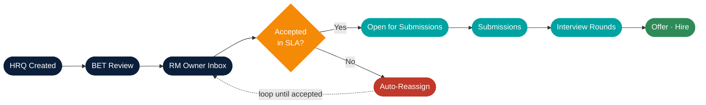
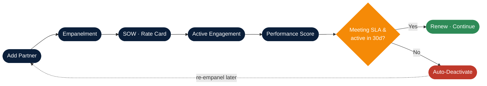
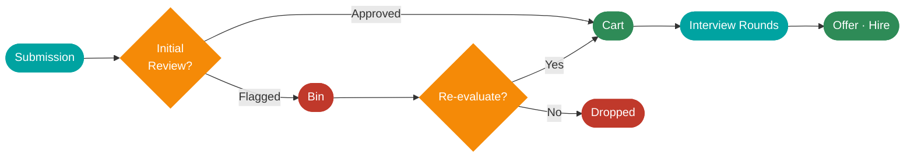
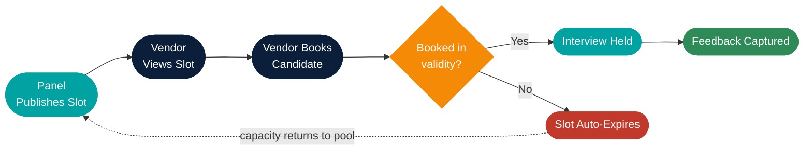
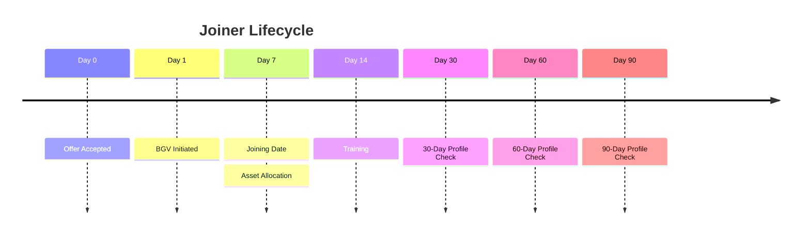

<!-- _class: lead -->

# Throughline
## Process Flow Diagrams

How work moves through the platform — at a glance.

> Same shape as how a GCC already operates — just enforced and instrumented.
>
> A Syntegreti product · v0.2

---

## 1 · Master Flow — Requisition to Day-90

**Background automation that quietly keeps the pipeline moving**

| Cadence | What runs |
|---|---|
| **Hourly** | Expire stale slots · drop candidates after 3 rejections |
| **Daily**  | Reassign aged HRQs · deactivate idle vendors · trigger escalations |
| **Always** | Audit log · email alerts · role-based dashboards |

> Eight stages, three sub-systems, one audit trail.

---

## 2 · HRQ Lifecycle — with Auto-Reassign Loop

> Every HRQ has a clock. If the RM Owner doesn't accept in SLA, Throughline
> reassigns it automatically — no chasing.

---

## 3 · Partner Lifecycle (PMS)

> Vendors run as a portfolio. 30 days of inactivity triggers an automatic
> deactivation; re-empanelment is a deliberate decision later.

---

## 4 · Candidate Journey — Cart vs Bin

**Auto-rule** — 3 rejections from interviews → candidate moved to **Bin** and flagged for review.

> Cart accelerates approved candidates. Bin is the safety net — nothing leaves
> the system without an explicit decision.

---

## 5 · Interview Slot — Self-Serve Flow

**Hourly job** — candidates rejected from 3 slots are auto-dropped from the active pipeline.

> Self-serve booking eliminates email back-and-forth. Auto-expiry means
> unbooked capacity is recycled — not lost.

---

## 6 · Onboarding — Day 0 → Day 90

**Continuously tracked on the candidate record**

- BGV status · Asset register · Training records
- Joining-reschedule history (with reason)
- 30 / 60 / 90-day progress

> One record from offer through Day 90. Reschedules and missed milestones
> surface immediately — joiners don't slip.

---

## 7 · Who Touches What — Roles × Stages

| Role | Raise HRQ | BET Approval | RM Accept | Vendor Alloc. | Slot & Interview | Feedback & Offer | BGV & Onboarding | Day 30/60/90 |
|---|:---:|:---:|:---:|:---:|:---:|:---:|:---:|:---:|
| **Hiring Manager**  | ● | ○ | ○ |   | ○ | ● |   | ○ |
| **BET Approver**    |   | ● |   |   |   |   |   |   |
| **RM Owner**        |   | ○ | ● | ● | ○ | ○ |   | ○ |
| **Partner / Vendor**|   |   |   | ● | ● |   |   |   |
| **Panel**           |   |   |   |   | ● | ● |   |   |
| **Onboarding SPOC** |   |   |   |   |   | ○ | ● | ○ |
| **TA Lead**         | ○ |   |   |   |   |   | ○ | ● |

`●` Primary owner   ·   `○` Involved / approver

> One owner per stage. Other stakeholders are involved but never ambiguous
> about who's accountable.

---

<!-- _class: lead -->

# That's the flow.

Same shape as how a GCC already operates — just enforced and instrumented.

**Next**
- Walk one of these flows on your real data — 30-min discovery.
- Pick two domains for a 6-week pilot — measure TAT lift.
